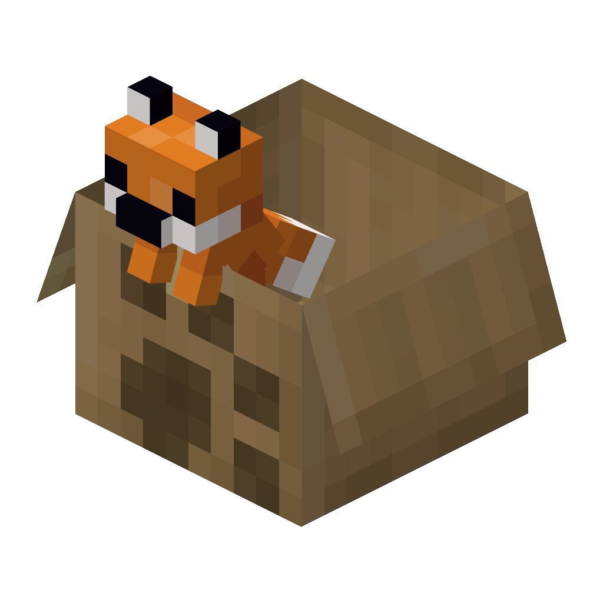

<!--suppress HtmlDeprecatedTag, XmlDeprecatedElement -->

Much more than just a fox in a box! More Than A Foxbox features familiar friends with configurable poses and noises.

---

More Than A Foxbox, the successor to [foxbox](https://modrinth.com/mod/foxbox), is a data-driven plushie mod, giving users the ability to create custom plushies.

It also provides built-in plushies, such as
- Red Fox
- Snow Fox
- Cow

Plushies are crafted using the new Sewing Table block, with a "shell" item, a "filler" item, and an "essence" item.
The shell item is usually wool corresponding to the color of the plushie.
The filler item is usually the new Polyfill item.
And the essence item is an item that is important to the mob the plushie is based off of.

Plushies can also be upgraded with Speakers and Sqeakers, giving them mob sounds or squeaker sounds, respectively.

Plushies can be placed on the ground, where you can select from 3 poses by crouch-clickinng the block, The poses are Sitting, Standing, and Laying.

You can also craft a Cardboard Box from Cardboard items, which you can place plushies into for a fourth pose.

Placed plushies interact with redstone, providing comparator outputs, and playing their sounds when powered.

If you want to add plushies, take a look at the [Examples Directory](https://github.com/Sweet-Berry-Collective/MoreThanAFoxbox/tree/fabric-1.21.8/examples) of our repository.

---

